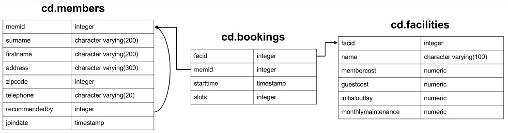

# Краткий конспект по задачам [pgexercises/basic](https://www.pgexercises.com/questions/basic/)


# Схема

Задача 1. Показать всю таблицу
```sql
select * from cd.facilities;
```

Задача 2. Показать только поля name, membercost из таблицы cd.facilities 

```sql
select name, membercost from cd.facilities;
```

Задача 3. Показать записи таблицы cd.facilities, содержащие оплату членских взносов
```sql
select * from cd.facilities facs
	where facs.membercost > 0;
```

Задача 4. Показать записи, для которых есть ненулевые членские взносы, при этом эти взносы составлять меньше 2% от месячного обслуживания 

```sql
select facid, name, membercost, monthlymaintenance
	from cd.facilities
		where membercost*50 < monthlymaintenance and
			membercost > 0;
```

Задача 5. Показать записи из таблицы cd.facilities относящиеся к Tennis

```sql
select * from cd.facilities
	where name like '%Tennis%';
```

Задача 6. Показать записи из таблицы cd.facilities c id = 1 или id=5.
```sql
select * from cd.facilities
	where facid in (1,5);
```

Задача 7. Выведите список объектов в формате имя, дешево/дорого. Дорогими считать в случае если месячное содержание обходится более 100$ 
```sql
select name, 
	case
		when monthlymaintenance > 100 then
			'expensive'
		else
			'cheap'
	end as cost
		from cd.facilities;
```

Задача 8. Вывести членов клуба, вступивших после 2012-09-01. 
```sql
select memid, surname, firstname, joindate 
	from cd.members
		where joindate >= '2012-09-01';
```

Задача 9. Вывести первые 10 фамилий членов клуба по алфавиту 
```sql
select distinct surname from cd.members
	order by surname
		limit 10;
```

Задача 10. Вывести одним списком фамилии членов клуба и список объектов
```sql
select surname from cd.members
    union
select name from cd.facilities;
```

Задача 11. Показать последнюю дату регистрации в члены клуба. 
```sql
select joindate from cd.members
    order by joindate desc
    limit 1;
```
или 
```sql
select max(joindate) as latest
	from cd.members;  
```

Задача 12. Показать последнего присоединившегося члена клуба 
```sql
select firstname, surname, joindate
	from cd.members
	where joindate = 
		(select max(joindate) from cd.members); 
```
