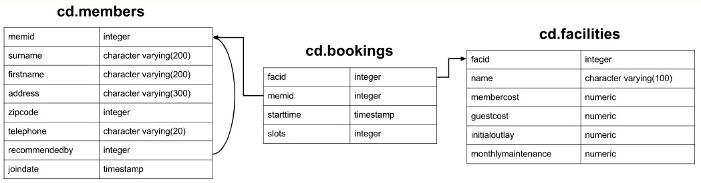

# Краткий конспект по задачам [pgexercises/joins](https://www.pgexercises.com/questions/joins/)


# Схема


Задача 1. Показать время старта для пользователя 'David Farrel'  

```sql
select bks.starttime
	from
		cd.bookings bks
		inner join cd.members mems
			on bks.memid = mems.memid
	where
		mems.surname='Farrell' and
		mems.firstname = 'David';
```
Важное:  
**INNER JOIN** < table_name > **ON** < condition >  - пересечение таблиц  

---
Задача 2. Отсортировать старт турниров с именем 'Tennis Court' проходящих 2012-09-21.
```sql
select bks.starttime as start, fcl.name as name
	from 
		cd.bookings bks
		inner join cd.facilities fcl
			on bks.facid = fcl.facid
	where 
		fcl.name like '%Tennis Court%' and
		bks.starttime >= '2012-09-21' and
		bks.starttime < '2012-09-22'
order by bks.starttime;
```
Важное:  
**ORDER BY** < field_name >  - сортировка по полю  
**LIKE** '%TEXT%' - поиск подстроки

---
Задача 3. Отсортировать список пользователей, которые были рекомендованы другими людьми по фамилии и имени, исключая повторения.
```sql
select DISTINCT mems.firstname, mems.surname
	from
		cd.members mems
		inner join cd.members recomm
		on 
			recomm.recommendedby=mems.memid
	order by mems.surname, mems.firstname;
```
Важное:  
select **DISTINCT** - исключить повторения

---
Задача 4. Показать список людей, отсортировав их по фамилии и имени, и показать фамилию, имя человека, кто их рекомендовал (если такие имеются).
```sql
select mems.firstname as memfname,
	mems.surname as memsname,
	recs.firstname as recfname,
	recs.surname as recsname
	from cd.members mems
		left join cd.members recs
		on mems.recommendedby = recs.memid
	order by memsname, memfname;
```
Важное:  
**LEFT JOIN** - все значения из левой таблицы плюс пересечение второй таблицы с первой

---
Задача 5. Показать список участников соревнований, выступающих на 'Tennis Court 1', 'Tennis Court 2'. Исключить повторы, отсортировать по имени участников.
```sql
select distinct mems.firstname || ' ' || mems.surname as member,
	fcl.name as facility
	from
		cd.members mems
		inner join cd.bookings bks
			on bks.memid = mems.memid
		inner join cd.facilities fcl
			on fcl.facid = bks.facid
	where
		fcl.name in ('Tennis Court 1', 'Tennis Court 2')
order by member, facility;
```
Важное:  
**TEXT1 || TEXT2** - склеивание текста с помощью ||  
**INNER JOIN** - можно использовать несколько раз подряд, как и любой другой JOIN  
**IN ('VALUE1', 'VALUE2', 'VALUE3')** - поиск значения в массиве

---
Задача 6. Вывести участников, потративших 2012-09-14 более 30$, сортируя по потраченным средствам в обратном порядке. В таблице facilities есть стоимость для членов и для гостей (membercost, guestcost соответственно), в таблице bookings необходимо эту стоимость умножить на slots. Гости определяются полем memid = 0.
```sql
select mems.firstname || ' ' || mems.surname as member, 
	facs.name as facility, 
	case 
		when mems.memid = 0 then
			bks.slots*facs.guestcost
		else
			bks.slots*facs.membercost
	end as cost
        from
                cd.members mems                
                inner join cd.bookings bks
                        on mems.memid = bks.memid
                inner join cd.facilities facs
                        on bks.facid = facs.facid
        where
		bks.starttime >= '2012-09-14' and 
		bks.starttime < '2012-09-15' and (
			(mems.memid = 0 and bks.slots*facs.guestcost > 30) or
			(mems.memid != 0 and bks.slots*facs.membercost > 30)
		)
order by cost desc;   
```
Важное:  
**DESC** - в обратном порядке  
**CASE**  
&nbsp; **WHEN** < condition > **THEN** < value1 > **ELSE** < value2 >  
**END**

---
Задача 7. Вывести список членов с указанием кто их рекомендовал, не использовать join.
```sql
select distinct mems.firstname || ' ' || mems.surname as member,
	(select recs.firstname || ' ' || recs.surname as recommender
	 	from cd.members recs
	 	where recs.memid = mems.recommendedby
	)
	from cd.members mems
order by member;
```
Задача 8. Повторение задачи 6, сделать используя подпоследовательности.
```sql
select member, facility, cost from (
  	select mems.firstname || ' ' || mems.surname as member,
	  facs.name as facility,
	  case
		  when mems.memid = 0 then
			  bks.slots * facs.guestcost
		  else
			  bks.slots * facs.membercost
	  end as cost
	from cd.members mems
	inner join cd.bookings bks
		on	bks.memid = mems.memid
  	inner join cd.facilities facs
  		on facs.facid = bks.facid
  	where bks.starttime >= '2012-09-14' and bks.starttime < '2012-09-15'
	  
  ) as subquery1
	where cost > 30
order by cost desc;
```
Важное:  
**SELECT** .. **FROM** (..) as < some_name > - выборка из подпоследовательности, обязательно именованной
