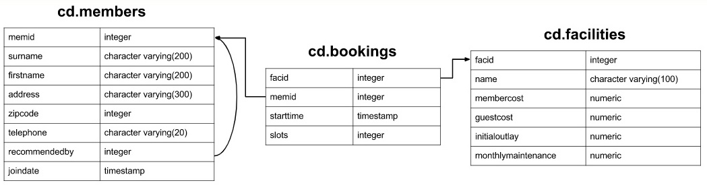

# Краткий конспект по задачам [pgexercises/updates](https://www.pgexercises.com/questions/updates/)


# Схема


Задача 1. Вставить данные в таблицу
```sql
INSERT INTO cd.facilities 
	(facid, name, membercost, guestcost, initialoutlay, monthlymaintenance) 
	VALUES (9, 'Spa', 20, 30, 100000, 800);
```
Важное:
Конструкция  
**INSERT INTO** < table name > (field1, field2, ...) **VALUES** (value1, value2, ..)
---

Задача 2. Вставить несколько данных в таблицу сразу
```sql
INSERT INTO cd.facilities
    (facid, name, membercost, guestcost, initialoutlay, monthlymaintenance)
    VALUES
        (9, 'Spa', 20, 30, 100000, 800),
        (10, 'Squash Court 2', 3.5, 17.5, 5000, 80);
```
вариант2: select value1, value2, .. может быть использован вместо values
```sql
INSERT INTO cd.facilities
    (facid, name, membercost, guestcost, initialoutlay, monthlymaintenance)
    SELECT 9, 'Spa', 20, 30, 100000, 800
    UNION ALL
        SELECT 10, 'Squash Court 2', 3.5, 17.5, 5000, 80;
```

Задача 3. Изменить данные по initialoutlay для facid = 1.
```sql
UPDATE cd.facilities
    SET initialoutlay = 10000
        WHERE facid = 1;  
```

Задача 1. Для facid=1, сделать цены на 10% выше, чем для facid=0.
```sql
UPDATE cd.facilities
	SET 
		membercost = 1.1 * (select membercost from cd.facilities where facid = 0),
		guestcost = 1.1 * (select guestcost from cd.facilities where facid = 0)
	WHERE
		facid = 1;
```

Задача 1. Показать всю таблицу
```sql
select * from cd.facilities;
```

Задача 1. Показать всю таблицу
```sql
select * from cd.facilities;
```